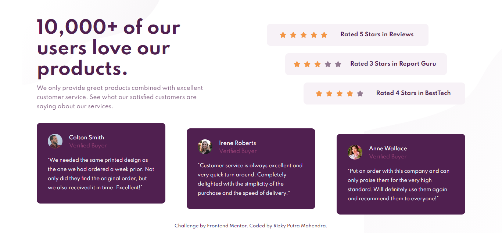
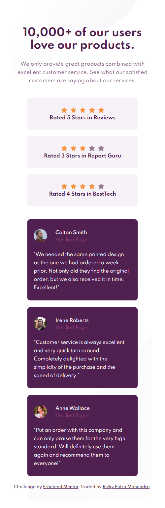

# Frontend Mentor - Social proof section solution

This is a solution to the [Social proof section challenge on Frontend Mentor](https://www.frontendmentor.io/challenges/social-proof-section-6e0qTv_bA). Frontend Mentor challenges help you improve your coding skills by building realistic projects.

## Table of contents

-   [Overview](#overview)
    -   [The challenge](#the-challenge)
    -   [Screenshot](#screenshot)
    -   [Links](#links)
-   [My process](#my-process)
    -   [Built with](#built-with)
    -   [Useful resources](#useful-resources)
-   [Author](#author)

## Overview

### The challenge

Users should be able to:

-   View the optimal layout for the section depending on their device's screen size

### Screenshot

### Links

-   Solution URL: [Github](https://github.com/rizky-pm/fm_social-proof-section)
-   Live Site URL: [Github Pages](https://rizky-pm.github.io/fm_social-proof-section/)

## My process

### Built with

-   Semantic HTML5 markup
-   CSS custom properties
-   Flexbox
-   Mobile-first workflow
-   [React](https://reactjs.org/) - JS library
-   [Styled Components](https://styled-components.com/) - For styles
-   [Fontawesome for ReactJS](https://fontawesome.com/v5.15/how-to-use/on-the-web/using-with/react) - For stars icon

### Useful resources

-   [CSS Variables for React Devs](https://www.joshwcomeau.com/css/css-variables-for-react-devs/)
-   [A Beginner’s Guide to Loops in React JSX](https://www.telerik.com/blogs/beginners-guide-loops-in-react-jsx)

## Author

-   Frontend Mentor - [@rizky-pm](https://www.frontendmentor.io/profile/rizky-pm)
-   Twitter - [@\_rizkypm](https://twitter.com/_rizkypm)
